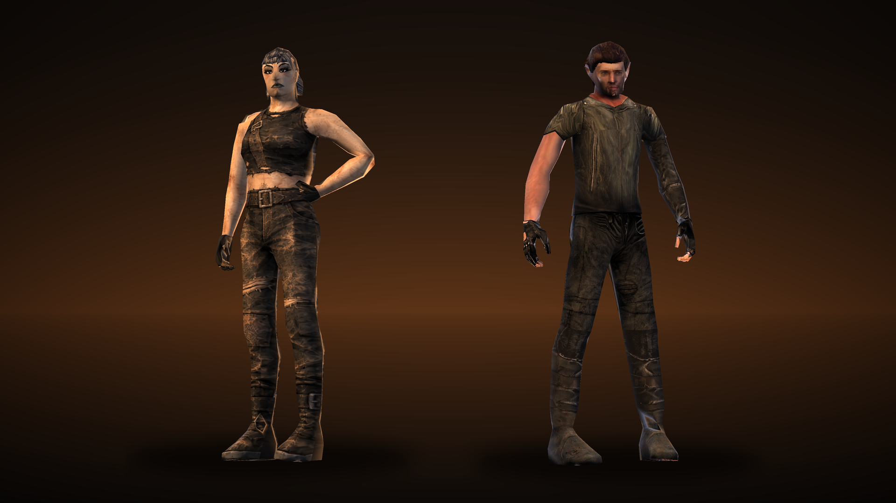

# Apocaplayer

**2.3.1 fixes climbing under wall pressure.** Small existing capsule/wall
penetration from physics contact no longer rejects an upward climb. The movement
must escape that contact without deepening it; new obstacles, ceilings and deep
overlap still block the climb. The native test suite now includes complete
climbs starting from pressed-against-wall positions.

**2.3.0 includes climbing.** Apocaclimber is no longer required; do not install
the old separate DLL alongside this version. Its numeric climbing settings are
migrated into Apocaplayer on first load.

Hold forward against a reachable wall and press the game's **Jump** key
(**Space** by default) to climb onto it. A failed climb keeps the normal jump.
The **climbing** settings group is just before **Debug**, which remains last:
**Jump triggers climbing** defaults On, with **alternative climb key** directly
below it, default **None**. Turn off jump climbing and bind an alternative if you
prefer a separate key. Low automatic steps are configured in this group too.

Climbing uses the waist/high Humanoid animations, temporarily puts the weapon
on its existing back/holster mount, and follows the animated head in first person
while retaining mouse look. Playback is 1.5x; the ending is cut at 65% so movement
returns in about 0.87 s for waist ledges and 1.44 s for high ledges. The detector
checks slightly farther forward at several heights, including raised car bodies.
The supported ledge range remains 0.45–2.5 metres with full capsule clearance.

First-person weapon and item sway (the game's own lag of the arms behind the view) eases the same at every frame rate,
so turning no longer makes the arms or the weapon jerk.

Vehicle hints and light controls follow the game's Controls bindings: default
**K = headlights**, **Space = handbrake**. Headlight input has one handler, so it
cannot toggle twice. The native handbrake handler is kept. The current game has
no ignition action, so the mod adds an **Ignition** row to the game's Controls
screen (after Handbrake, default E); rebind it there. The key is kept in
`BepInEx\config\Apocaplayer\ignition-key.txt` (the game drops added rows on load).



BepInEx 5 mod for **Apocalypter**: see your character - a full body in first person, a third-person camera on foot and in cars,
and a choice of **Female** (her own model), **Male** (the game's own player man) or **Max** (a road warrior in a leather jacket), with the same animations and features for both.

- **First person** – her body under the camera: legs, hips and torso when you look down, her shadow on the ground.
  The game's own first-person arms are kept (every reload, melee swing and item animation still works) but wear her
  skin and black gloves; the kick leg wears her boot.
- **Third person on foot** – the game's *Change Camera* key (the one that switches views in a car) also works on foot:
  a camera over her right shoulder; the mouse wheel zooms (saved separately on foot and in cars); holding Left Alt (`RebindObserving`) orbits the camera around the character (`Toggle Observing` makes a press stick until the next one). Shots and picks still come from the first-person eye; the view is turned so the screen centre is exactly where they land, so aim with the crosshair.
  It works in cars too: dashboard clicks are blocked in third person so switches do not capture shooting or camera zoom.
  Use the vehicle hotkeys below; Exit (F) at the door still works, and you stay in third person when you get out.
  On death, animation stops and a jointed physics ragdoll falls from the current pose; the third-person camera follows the body.
  Her body is animated with the game's own humanoid raider clips (idle, run, rifle/pistol aim, melee swing) plus a
  procedural walk, strafe, crouch, prone and aim-pitch; the gun in her hand is the NPC model of the weapon you hold
  (Flexa's AKM, Sprokka's pipe pistol, Lugnut's shotgun …) at the spot the raiders hold it.
- **Cars** – she sits in the driver's seat instead of the game's seated man (car third-person camera), and in first
  person you see her legs and arms on the wheel.

In first person the inside of her body is drawn too (darker), so where the camera cuts into her (the neck opening, the chest when looking down) you see her inside rather than the ground through her, and the openings left where the head (and arms) are removed - the neck, the shoulders - are closed with a solid surface. First person with nothing in hand, the game draws no arms; with `General / FirstPersonArms` (default off) her own arms are shown instead, moving with the body's normal idle/walk/run animation and on the wheel in a car.

The Max model (`Models/Player_max.glb`) is Denis's low-poly Max (made from the game man's mesh) with his own UV layout on `Models/Player_max.png`; `Models/player_character_2_UI_max.png` is Max's TAB-screen picture (rendered in the game picture's pose, framing and warm light).

The female model is **Player_female** (made from the Flexa model, rigged to Flexa's 22-bone mixamo skeleton).

`AutomaticStepUp` (climbing, default On) helps the grounded player walk onto low solid steps and obstacles up to 35 cm,
including vehicle entrance steps. It uses existing foot collision contacts, then checks the landing surface and clearance
for both body capsules before lifting the Rigidbody. Tall obstacles, low ceilings, jumping, prone movement and driving are excluded.
Player collider dimensions and horizontal movement remain the game's own.

When `Character = Female`, pain events use `Sounds/Female/human_hurt.wav` and `Sounds/Female/human_hurt_2.wav`.
This covers on-foot, in-car and head-hit pain in either camera view. The game keeps its normal timing, volume and random selection;
male characters and NPCs keep their original sounds. The supplied files are loaded once as 16-bit PCM WAVs.

Rustliner side and rear doorways have a local standing-clearance fix. While the player crosses an entrance, the vanilla body
capsules temporarily ignore only the identified upper-frame boxes; leaving the doorway restores those collision pairs.
Closed door panels, floor and other body collision remain active. Player hitboxes and bus collider dimensions are unchanged;
the frame still collides with other objects and projectiles. The fix works in first and third person and restores its changes when the mod is disabled.

Equipped gear appears on both character models: the worn backpack on the back at 0.8 scale, rotated 90 degrees clockwise around
the vertical axis and fitted close to the body; the first two shotguns/rifles/automatic rifles crossed close against the bare back,
or vertical beside an equipped backpack with muzzles down and magazines facing backward;
the first two pistols/SMGs at the right and left thighs; the first two machetes/knives/shivs at opposite belt sides;
and equipped binoculars behind the belt. The equipped flashlight is worn too: the Police Flashlight on the left of the belt, the Old and Military Flashlights on the left of the chest, all pointing forward; while the flashlight is on, a small light glows at its lens. Items are chosen in slot order, including slots 4–6 supplied by the optional inventory mod.
Drawing an item hides only its own mount and reserves that place until it is sheathed; a third item is never promoted to fill it.
Models are visual copies of the actual inventory items. Equipping, removing, and replacing gear updates them automatically.
`EquipmentInventory.cs` reads Apocapocket's logical inventory (also accepts the Apocainventory namespace with the same contract),
so drawing an extra-slot weapon into a temporary vanilla slot does not change the mounts. No inventory mod is required for slots 1–3.

## Install

Copy the `Apocaplayer` folder into `BepInEx\plugins\`:

```
BepInEx\plugins\Apocaplayer\Apocaplayer.dll
BepInEx\plugins\Apocaplayer\Models\Player_female.glb
BepInEx\plugins\Apocaplayer\Models\Player_female.png
BepInEx\plugins\Apocaplayer\Models\Player2_female_arms.png
BepInEx\plugins\Apocaplayer\Models\Player_male.glb
BepInEx\plugins\Apocaplayer\Models\Player_male.png
BepInEx\plugins\Apocaplayer\Models\Player_max.glb
BepInEx\plugins\Apocaplayer\Models\Player_max.png
BepInEx\plugins\Apocaplayer\Models\Player2_max_arms.png       (Max's right arm + kick leg in first person)
BepInEx\plugins\Apocaplayer\Models\Player2_max_arms_left.png  (Max's left arm in first person)
BepInEx\plugins\Apocaplayer\Models\player_character_2_UI_max.png   (Max on the TAB screen)
BepInEx\plugins\Apocaplayer\Models\player_character_2_UI.png
BepInEx\plugins\Apocaplayer\Models\apocaplayer_anims.bundle   (optional: the Mixamo animations, built with UnityAnims/)
BepInEx\plugins\Apocaplayer\icon.png                          (Apocasetter's Mods menu)
```

## Settings (`BepInEx\config\com.denis.apocalypter.apocaplayer.cfg`, also in the Apocasetter Mods menu)

Version 1.4.0 includes a camera cutaway **prototype**. Third-person distance stays fixed through blocking walls, vehicles and terrain.
A soft window around the character blends a clear view with the obstruction at 20% opacity; the rest of a large object keeps its normal appearance.
The window ends strictly before the character: front walls remain opaque when the player presses against them, even if the same building mesh also forms a rear obstruction.
This also covers the occupied vehicle and cameras inside a collider. The game's eye transform, physics and materials are preserved.
The prototype uses two extra scene passes while obstructed (clear view and protected forward geometry), so performance and interaction with other post-processing effects need in-game evaluation.
Roof/ceiling and vehicle obstructions expand the transparent window radius to three times its normal size, with a smooth transition.
The body configuration has `General / 3rd person camera culling` (On/Off, default Off since 2.2.9; never inside caves). Off restores the previous collision camera;
the former `CAMERA / OcclusionPrototype` preference migrates automatically. Binoculars and first person use the normal game view.

| Section | Key | Default | |
|---|---|---|---|
| General | Enabled | true | Off = the game's own player (arms, driver, TAB picture) comes back at once |
| General | Character | Female | Model selection: Female, Male or Max |
| General | FirstPersonArms | false | First person with nothing in hand: the body's own arms (walk swing, hands on the wheel). Off = no body arms in first person; the game's weapon/item arms always show |
| Debug | FirstPersonCameraX / Y / Z | 0 | On foot, first person with BodyFirstPerson: move the view right / up / forward (m) relative to the body (the body moves the opposite way; aiming and clicks unchanged) |
| Debug | FirstPersonDrivingCameraX / Y / Z | 0 | The same in the driver's seat (seat's right / up / forward), on top of the built-in seat offset (-0.03, 0.02, 0.02) |
| General | 3rd person camera culling | false | Body configuration: On/Off for the transparent outline; roofs and cars get a 3x radius; switched off automatically inside caves. |
| General | 3rd person camera culling in vehicles | false | Use the camera culling while driving too. The ground is never cut away |
| CAMERA | DynamicCrosshair | true | Third person: the crosshair sits where shots, melee hits and pickups really land (the ray from the head) - centre for far targets, moving left toward the character for close ones, on the head when looking straight down. Off = the camera turns toward the aim point instead |
| CAMERA | OcclusionOpacity | 0.2 | Remaining opacity of the obstruction in the window (0 = clear) |
| CAMERA | OcclusionRadius | 0.55 | Radius around the character in metres; controls the window's width |
| VEHICLE | VehicleHotkeyHint | true | Show hotkeys on the left while driving; hiding them keeps the controls working |
| VEHICLE | VehicleStatusHint | true | Top-right icons: key when ignition is off, (P) while handbrake is engaged, cassette with 0.0–1.0 volume while music is playing (including muted playback) |
| Game Controls | Headlight | K | Rebind in the game Controls menu; the vehicle hint follows primary and alternative bindings |
| Game Controls | Handbrake | Space | Native handbrake control; its apply/release key is shown in the vehicle hint |
| VEHICLE | CassetteKey | Z | Start / stop cassette. Starting at zero sets volume to 0.5; a nonzero volume is preserved |
| VEHICLE | VolumeDownKey | Minus | Reduce cassette volume by 0.1, clamped at 0; also accepts numpad minus |
| VEHICLE | VolumeUpKey | Equals | Increase cassette volume by 0.1, clamped at 1; + on the main keyboard (= physical key) or numpad plus |
| General | BodyFirstPerson | false | First person: see the body (legs and torso when you look down, the shadow, the body in the driver's seat); off = only the first-person arms |
| General | RebindObserving | LeftAlt | Third person: the observing key - orbits the camera around the character (held, or press on / press off with Toggle Observing); None = no key |
| General | Toggle Observing | false | Third person, observing key: off = hold it to orbit the camera around the character, it returns behind the character on release; on = a press starts observing and the camera stays until the next press |
| Animation | RunLegsIn | 6 | Running with the bundle animations: each thigh turned this many degrees toward the middle (feet kept flat) - the rifle pack's run cycles stand wide on her hips. 0 = the clips as they are |
| Debug | WeaponAdjustment | false | Third person: numpad 8/2 6/4 7/1 move the weapon in the hand, 5 move/rotate, 9/3 pick the clip (every rifle / pistol clip), - / * delete/copy/paste; saved to `config/Apocaplayer/weapon-poses.txt` (overrides the built-in poses) |
| Debug | VerboseLog | false | Diagnostics for performance reports (PC info once, then FPS, stutters and Apocaplayer's own ms per frame every 10 s, plus what the mod finds and decides). Off = nothing measured or written. |

Throws from the driver's seat (blast lance, quick grenade) work like guns there: her chest turns to the aim (a learned per-clip
correction puts her throwing hand on the aim line at the release), past 95° to a side she turns round and crouches; the throw clip and
its timing are the same as on foot, played once. A blast lance thrown from a car ignores that car's colliders (`Projectiles.cs`), so it
doesn't blow up on your own doors and windows.

Third person, right mouse button (Aim Down Sights) with a non-scoped gun: the view zooms in toward the crosshair (narrower field of view,
camera a little closer) and the crosshair stays - the game's own sights are on the first-person gun, which isn't drawn in third person.
Scoped guns keep the game's scope.

Transitions: a new animation always starts at once at its own time and speed, and the previous pose fades out under it - upper-body
clips (reload, aim, fire, throw, punches, swings) cross-fade in 0.08-0.15 s, switching between unarmed / rifle / pistol blends her
body over 0.2 s (the gun is in her hand at its correct grip from the first frame), getting into / out of the driver's seat eases over
0.3 s and turning off the seat in a car over 0.25 s. Nothing is delayed or made longer.
Aiming down sights in first person (right mouse button) moves the gun from the hip to the sights and back over 0.2 s
(easing out) instead of jumping there; hidden setting `[Camera] AimDownSightsTime`, 0 = the game's instant move.
In the driver's seat she sits 5 cm lower than the game's man (hands at the steering wheel). First person in a car with her body shown
(`BodyFirstPerson`), clicks on the ignition, lights and switches are cast from the eye the picture is drawn from, so the cassette player
no longer gets in the way.
Binoculars raised in third person show the game's own binocular view (full zoom, from her eyes, her body not in the way);
the camera goes back behind her when they are lowered.

Third person on foot, picking: when the game's eye ray misses (common behind the shoulder with small items), the item, part or switch nearest
the cursor ON SCREEN is picked - within 6 % of the screen height, visible from the camera, within the game's own reach from her eye
(`PickAssist.cs`, a Harmony postfix on PlayMaker's `ActionHelpers.DoMousePick`). Screen-space, so it works the same at every zoom.


Everything else is fixed: her body in first person, her arms, the driver and TAB picture, the third-person camera (Change Camera key, on
foot and in cars) and the camera offsets are always on, as `H(...)` entries in `Plugin.cs` (change one to `Config.Bind(...)` to expose
it). The mouse-wheel camera distances are remembered in `config/Apocaplayer/camera.cfg`.

## The male body

`Models/Player_male.glb` + `Models/Player_male.png` = the game's own player man (mesh `Player2` of the cars' `PlayerModel_Sit`, his
`PlayerHair.002`, `PlayerBeard.003`, `bag1`, `bag2`, `pouch1.001`; texture `Player2`), re-rigged onto Flexa's skeleton by
`tools/bake_male.py`: each of his bones follows the mixamo bone it maps to (the same pairs and swing as the car-seat retarget), the
rigid extras are baked in on his head / spine bone, and the beard (own texture `hair3`, not exported) takes one hair-coloured texel
of the `Player2` atlas. Inputs: `_export/Player2.json`, `_export/extras.json`, `_export/prefabs.json` (UnityPy dumps), `Player_female.glb`
(for the skeleton nodes).

## Using another model

Any `.glb` rigged to Flexa's skeleton works (same 22 `mixamorig:` bones, unmoved — the log reports the skeleton
offset; above 5 cm she will look deformed). Export from Blender with *Skinning* on, ≤ 4 weights per vertex. Point the
hidden `Model`/`Texture` entries at it. The arms texture is a separate atlas (see *How it works*); re-bake it with
`tools/bake.py` for a new outfit.

## ModAPI (for other mods)

Other mods can animate **any humanoid** (NPCs, companions, mannequins) exactly like her third-person body:
the same clips and the same logic, so what the player gets, they get. Only the clips the player itself
uses are offered (`ModAPI.ClipNames()`, 70 of the bundle's 76; the death clips are not part of it).

```csharp
using Apocaplayer;                                   // reference Apocaplayer.dll; [BepInDependency("com.denis.apocalypter.apocaplayer", SoftDependency)]
if (ModAPI.Ready) {
    var c = ModAPI.Attach(animator);                 // null: not a humanoid / no animation bundle
    c.SetWeapon(gunModel);                           // into the right hand at the player's weapon poses (put back by SetWeapon(null) / Dispose)
    // every frame, in Update - the velocity comes from its Rigidbody by itself (or ManualVelocity + Velocity)
    c.Crouched = ...; c.Aiming = ...; c.Firing = ...; c.Airborne = ...; c.AimPitch = ...;
    // events
    c.Reload(seconds); c.Reload(seconds, rounds);   // the whole clip fitted to the time / one round at a time
    c.Pump(); c.Jump(); c.Kick(); c.Throw(); c.Strike(seconds); c.Shoot();
    c.Suspended = true;                              // the Animator's own controller for a while (death, a seat ...)
    c.Dispose();                                     // also automatic when the Animator is destroyed
}
```

- **Locomotion**: idle, 8 directions x walk / run / sprint, crouch idle, 8 crouched walks, the relaxed set when not
  aiming, direction changes that turn instead of snapping, turns in place driven by its turn, walk-to-stop, jumps.
- **Hands**: the rifle low-ready and aim, the pistol lowered and aimed, fire, reloads (whole or one round at a time),
  `ShotgunPump`; the aim lift and the weapon pose per clip from the player's tables; throws, punches, melee swings, kicks.
- **Facts**: `WeaponKey`, `WeaponKind`, `WeaponPose`, `AimLiftOf`, `ReloadClip`, `ReloadClipSeconds`, `RoundSeconds`,
  `ReloadsOneRoundAtATime`, `CocksAfterShot`, `NativeSpeed`, `GetClip` (player clips only).
- State to read: `HandsClip`, `ActionClip`, `UpperClip`, `Reloading`, `Pumping`, `SpeedCap` (the fastest it may move
  without its feet sliding).

The decisions are in `CharPlan.cs` (no Unity types); `tools/modapitest/run.sh` runs every weapon kind through every
situation and two NPC timelines outside the game (5.8 million frame checks), builds the poses from the FBX clips and
draws them. NPCAI 1.2.0 uses it for its gunmen.

## How it works

- **Body** (`Body.cs`): a clone of Flexa's `Anim` object (Animator, avatar `enemy_1_IdleAvatar`, the skeleton, the
  skinned renderer), made while inactive and stripped of props, colliders and FSMs, with our mesh. A `PlayableGraph`
  drives the Animator: idle/run mixer + an upper-body layer (AvatarMask: body, head, arms) for the weapon clip.
  `LateUpdate` adds the procedural layers in the Anim object's own (unmirrored) space, so the mirror on the root is safe.
  Three mesh variants from one file (`Model.cs`): full, no head (car first person), no head + no arms (first person on foot);
  a second renderer draws the full body shadows-only in first person.
- **Arms** (`Arms.cs`): every first-person arm (`player_arm_left` / `player_arm_left.002`, 8 bones) and the kick leg use
  material `Player2` — the same atlas as the seated driver. Those renderers get a copy of the material with
  `Player2_female_arms.png`: the arm/leg UV islands re-painted from her texture (`tools/bake.py`: each texel of an arm
  triangle → its point on the game arm in bind pose → same place along her arm bone → nearest point on her mesh → her
  texel), everything else untouched.
- **Car** (`CarSeat.cs`): each car has a `PlayerModel_Sit` (27-bone `Player2` driver in a fixed driving pose, plus hair,
  beard, bags), toggled by the car's Camera FSM. Its renderers are disabled and its pose is copied onto her skeleton every
  frame: `her.rotation = its.rotation * Δ`, hips at `itsSpine1 * offset`. Δ comes from the two bind poses (both T-poses;
  Player2 mesh space → Flexa mesh space is `(x, y, z) → (x, z, -y)`) with a swing so every bone points along its partner
  (`tools/retarget.py` verifies it by skinning her into the seat offline).
- **Third person** (`ThirdPerson.cs`): `Camera.onPreCull` overrides the PlayerCamera's `worldToCameraMatrix` and matching culling matrix;
  the transform is never moved, so every game raycast is unchanged. First-person renderers under the
  PlayerCamera get `forceRenderingOff` while the view is behind her.
- **Weapon in hand** (`Props.cs`): NPC weapon props are found on the prefabs' `mixamorig:LeftHand` (guns) /
  `RightHand` (blades) and copied (render-only) onto her hand at the same local pose.

## What the game does not have (and how to add it)

The game ships only these humanoid clips: `merchant_idle`, `enemy_1_idle`, `enemy_1_run`, `enemy_1_attack`,
`enemy_machinegun`, `sprokka_shoot`, `spanna_two_handed_attack`, `zombie_idle/run/attack`. No walk, strafe, crouch, prone,
sit/drive or jump — those are procedural here (walk cycle, strafe twist, squat, lying flat) or copied (car seat).
Better animations need either an AssetBundle built with Unity 2020.3.49f1 (humanoid clips retarget to her automatically)
or a glTF animation sampler in the plugin (not written yet).

## Better animations (optional bundle)

`UnityAnims/` is a tiny Unity 2020.3.49f1 project: drop Mixamo FBX files in, run *Apocaplayer → Build animation bundle*, and it
writes `Models/apocaplayer_anims.bundle`. See `UnityAnims/README.md` for the file names.

Since 2.0 the bundle works like this: **Mixamo's Rifle pack is the lower body of every weapon** - idle, walking / running / sprinting in
eight directions, crouching in eight directions, turning in place and the jump, blended by the body's real direction and speed (no mirrored
clips: a mirrored strafe put the gun in the other hand). The pack's set is an *aiming* set (hips square, the right foot turned out, legs
crossing on strafes): it carries a melee weapon always, and a pistol / rifle while aiming or shooting. Otherwise (bare hands, throwables,
a lowered pistol or rifle) the standing legs are the **relaxed set**: `Idle` standing, the low-ready walk `RifleWalkLow` forward, the strafe walk
`WalkStrafeLeft` (mirrored for the right side), `WalkBack`, diagonals blended from those two; running = `RifleRunLow` / `RifleSprint` with the hips
turned toward the way she runs (`RunLegsTurn`), the pack's straight run back for backward; `RifleWalkToStop`'s last step settles a stop and
`LeftTurn` / `RightTurn` (mirrored) turn her in place - their feet are driven by the turn itself from the first degree (each degree she turns advances the clip by the part of it that turns one degree), so they never slide; the legs' walking direction turns smoothly when the keys change (DirBlendSpeed, 360°/s). **Crouched, every weapon uses the pack's crouch** (its own crouched arms with a rifle);
with bare hands the crouched strafe left is the pack's strafe right mirrored (`CrouchStrafeLeft`, made by the builder - the pack's own left
one crosses over like aiming; pistol and rifle keep it), and crouch-walking with bare hands the chest follows the pelvis half-way, the twist
shared by the three spine bones. Letting go of the keys after walking forward plays `RifleWalkToStop`'s last step from the point of its walk cycle
that matches her legs (no match, the right foot swinging: no clip). Jumps: each jump clip starts just before its take-off, holds its apex
while she is in the air and goes to its touch-down when the game's [Jump] FSM lands her; moving, it fades straight back to the legs.
**Aim lift** (2.1.7): the game shoots from her eyes, the Mixamo aim clips hold the rifle ~30 cm lower - while an aim / fire clip moves her
hands both hands are lifted (and pushed forward) by an arm IK and her head tilts onto the stock, per weapon and clip (default rifles: 15 cm,
10°). With WeaponAdjustment on, while aiming (or with an aim clip picked by numpad 9/3): Page Up/Down = lift, Home/End = head, Insert/Delete =
forward; the hint shows how far the top of the gun is under the eyes. Saved to `config/Apocaplayer/aim-lift.txt` (weapon-poses.txt untouched).
The tuned aim lifts and weapon poses are built in (2.1.9: AimLift.BuiltinData, BuiltinPoses.cs); the config files override them.
Standing and crouched have their own values (2.1.8; a crouched aim without its own entry starts from the standing one).
Guns that load one round at a time (revolver, shotguns, the bolt rifle, the double barrel) play the reload clip's fetch-and-insert part once
per round, in step with the first-person arms; aiming down a scoped gun's sights shows the game's own first-person scope view.
Reloads play `RifleReload` / `PistolReload` on the upper body; cocking the pump shotgun or the bolt rifle (their [Attack] FSM in "pump" /
"bolt action") plays `ShotgunPump`'s rack. Every moving clip is played at the same point of the stride: each clip's phase (where its left foot is highest) is measured once on her
skeleton, so clips from different downloads and the mirrored strafe step together.
With a rifle the low-ready hands show over the relaxed legs, and aiming (right mouse button), firing and
reloading put `RifleAim` / `RifleFire` / `RifleCrouchAim` / `RifleCrouchFire` / `RifleReload` on the upper body. With a pistol the upper body is
`PistolIdle` (lowered), `PistolRun` while running, `PistolFire` (aiming: its first frame; shooting: playing) and `PistolReload`; with bare hands
or a melee weapon `Idle`, `Walk` / `WalkBack`, `Run` (in step with the legs) and `CrouchIdle`. A standing clip's upper body on crouched legs
is done by a hidden second copy of her skeleton (the *UpperRig*) whose spine, arms and head she copies - an avatar mask alone would lift her
out of the crouch. With at least `RifleIdle` + `RifleWalk` (or `RifleWalkLow`) in the bundle her body uses it; without them the raider clips and the
procedural walk (the log says so).

All the choices above are in `LocoPlan.cs`; `tools/locotest/` runs them for every weapon and position outside the game and draws / measures
the poses from the FBX clips (`run.sh`).

**Weapon poses** (`WeaponAdjustment`, numpad): the weapon's place in her right hand is kept **per clip** - every rifle clip (all 34 locomotion
clips, aim, fire, reload, turns, jumps, kick) and every pistol clip (idle, run, fire, reload, jump, kick) has its own entry, and numpad 9/3 cycle
through all of them, each played standing still. A clip without an entry shows the kind's idle pose (`RifleIdle` / `PistolIdle`).

Blast lance: held in her right hand (its world model, placed like a machete); its throw plays `ThrowRight` (right-handed;
the grenade's `Throw` is the left-handed one) timed so her release comes when the game lets the lance go.
Melee weapons: a swing plays `Melee` timed to the first-person swing; swings chained straight after it (held button, fast clicks)
play `MeleeCombo`'s two blows by turns. Bare hands: `Punch` (eight blows in one clip, in order; or `Punch1` / `Punch2` by turns). During a
strike the chest faces the crosshair. A strike follows the game's `[Attack]` FSM (the hit lands the moment the swing starts): the clip's
wind-up in 0.08 s, then the blow and the way back over the swing's cycle (0.35 s hands, 0.4 s machete). The blow times are read off the
clips (`Body.cs`, `PunchSeq` / `Combo`).

## Build

The camera prototype also needs `Models/apocaplayer_camera.bundle` (included). Rebuild it with Unity 2020.3.49f1:
open the small `CameraShaders` project, or run its editor in batch mode with `-executeMethod BuildCameraShaders.Build`.
`OcclusionCutaway.cs` renders the clear pass, restores all renderer/terrain flags immediately, then depth-tests the localized blend.
`tools/verification/Run.ps1 -Camera` exercises the prototype in an isolated native runtime and exports screenshots.

Vehicle HUD assets live in `Models/Hud/`; `design/vehicle-hud.png` is the icon mockup and `tools/build_hud_icons.py` rebuilds the assets.
`Ragdoll.cs` uses eleven jointed physics proxies in world space so both character models and mirrored fallback animations can fall naturally.
`VehicleHud.cs` draws the optional status icons; `Car.cs` drives the game's switch FSMs and synchronizes hotkey volume with the dashboard knob.

`./build.sh` (mcs, against the game's own DLLs; `MANAGED=… BEPCORE=…` to override the paths) or `dotnet build`
with `Apocaplayer.csproj` (deploys DLL + Models to the game). `tools/` holds the Python scripts used to read the game
assets (UnityPy) and to bake/verify the arm texture and the car-seat retarget; they are not part of the build.

## ModAPI usage guide (every animation)

### Setup

Reference `Apocaplayer.dll`. Add `[BepInDependency("com.denis.apocalypter.apocaplayer", BepInDependency.DependencyFlags.SoftDependency)]` to your plugin.

```csharp
using Apocaplayer;

if (!ModAPI.Ready) return;                     // no animation bundle -> nothing to do
var c = ModAPI.Attach(npc.GetComponentInChildren<Animator>());   // humanoid only, else null
c.SetWeapon(gunModelTransform);                // or c.SetWeapon(null) for bare hands
```

The weapon's object name decides the weapon kind and so which animations play:

| Kind | Weapons |
|---|---|
| **Rifle** | rifles, shotguns, crossbow |
| **Pistol** | pistols, revolver, SMGs |
| **Melee** | machete, knife, shiv, wrench |
| **None** | `SetWeapon(null)` |

The gun model is moved to the right hand at the player's tuned positions.

Set the per-frame inputs in `Update`. Apocaplayer animates the character in `LateUpdate`.

### Movement (automatic, from the character's velocity)

Velocity comes from its Rigidbody, or its movement since the last frame if it has none. You can also set `c.ManualVelocity = true` and `c.Velocity = ...` yourself. Direction is measured relative to where the character faces.

| You do | Animation |
|---|---|
| Stand still | Idle (rifle, pistol or unarmed) |
| Move under ~3 m/s, any direction | Walk in 8 directions: forward, back, strafes, diagonals |
| Move ~3.2 m/s or faster | Run in 8 directions |
| Move ~4.3 m/s or faster | Sprint in 8 directions |
| `c.Crouched = true` | Crouch idle, and crouch walk in 8 directions |
| Rotate it while it stands still | Turn in place, feet stepping with the turn (`c.TurnInPlace`, on by default) |
| Stop after walking forward relaxed | Walk-to-stop step (`c.WalkToStop`, on by default) |

Stance depends on weapon and aiming:
- **Rifle or pistol, not aiming:** relaxed. Rifle low-ready, lowered pistol, natural walk and run.
- **`c.Aiming = true` or `c.Firing = true`:** aiming stance and aiming hands.
- **Melee weapon:** always the fighting stance.
- **Bare hands:** always relaxed.

### Hands

| You do | Rifle | Pistol | Bare hands / melee |
|---|---|---|---|
| Nothing | RifleIdle, RifleWalkLow, RifleRunLow (low-ready) | PistolIdle, PistolRun | Idle, Walk, WalkBack, Run, CrouchIdle |
| `c.Aiming = true` | RifleAim (crouched: RifleCrouchAim) | PistolFire, held on its first frame | — |
| `c.Firing = true`, or `c.Shoot()` for a quarter second | firing stance | PistolFire playing | — |
| `c.AimPitch = deg` | spine bends to aim up or down (+ = down) | same | same |

### Events (call once each)

| Call | Animation |
|---|---|
| `c.Reload(2.5f)` | RifleReload or PistolReload, fitted to 2.5 s; the legs keep moving |
| `c.Reload(3f, 5)` | One round at a time, 5 rounds in 3 s (revolver and shotguns style) |
| `c.CancelReload()` | Stops the reload |
| `c.Pump()` | ShotgunPump rack after a shot (rifle kind only, ignored while reloading) |
| `c.Jump()` + `c.Airborne = true/false` | Jump: take-off, held in the air, landing when Airborne goes back to false (rifle: RifleJumpUp, Loop, Down; pistol: PistolJump; others: Jump) |
| `c.Kick()` | Kick |
| `c.Throw()` / `c.Throw(true)` | Grenade throw with the left hand / right hand |
| `c.Strike(0.4f)` | Bare hands: punch combo, each call the next blow. Melee: Melee swing, then MeleeCombo blows when chained |

### Control

```csharp
c.Suspended = true;    // the game's own animations back (death, sitting in a car...); gun returns to its own hand
c.Suspended = false;   // the player's animations again
c.Dispose();           // done with it (also automatic when the Animator is destroyed)
```

### Useful reads

```csharp
c.HandsClip, c.ActionClip, c.UpperClip            // what is playing now
c.Reloading, c.Pumping                            // event still running
c.SpeedCap                                        // fastest speed before the feet slide
ModAPI.ReloadsOneRoundAtATime(key), ModAPI.CocksAfterShot(key), ModAPI.RoundSeconds(key)
ModAPI.ClipNames(), ModAPI.GetClip(name)          // the player's clips only
ModAPI.WeaponPose(key, clip, out pos, out rot), ModAPI.AimLiftOf(key, clip, crouched)
```

### Minimal NPC example

```csharp
void Update() {
    c.Crouched = inCover;
    c.Aiming   = facingTarget;
    c.Firing   = shooting;
    c.Airborne = !grounded;
    if (magazineEmpty) c.Reload(ModAPI.ReloadClipSeconds(c.WeaponKey));
    if (burstEnded && ModAPI.CocksAfterShot(c.WeaponKey)) c.Pump();
    if (dead) c.Suspended = true;
}
```

NPCAI 1.2.0's `ApBody.cs` and `Brain.Drive` are a full working example.
